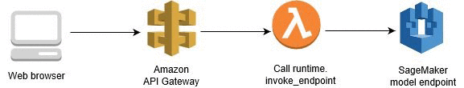
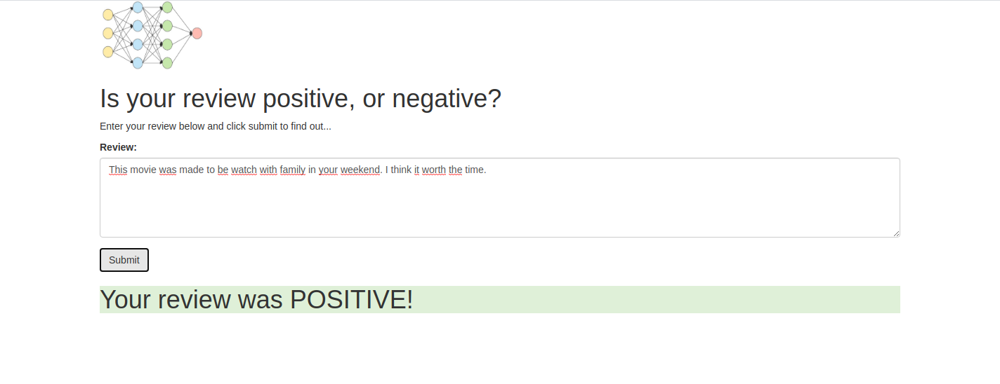
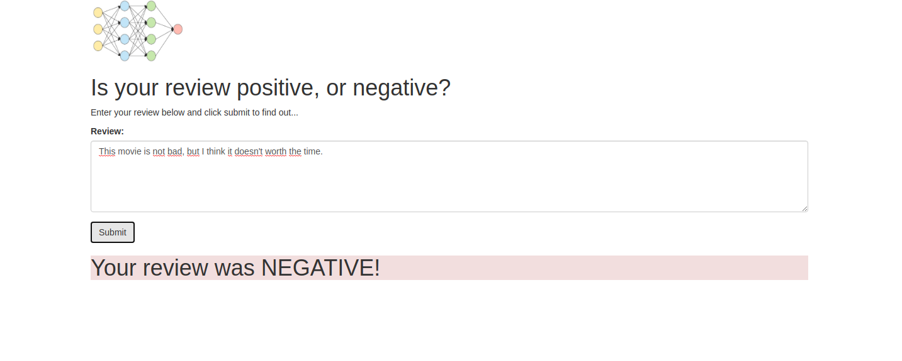

# IMDBClassifier

First project from [Machine Learning Engineer Nanodegree Program Udacity course](https://www.udacity.com/course/machine-learning-engineer-nanodegree--nd009t)

## Motivation

This project consists in implement a Recurrent Neural Network (RNN) that is capable to predict if a text that has a good or bad opinion about a movie.
The dataset used to train and test is based at [IMDB](http://ai.stanford.edu/~amaas/data/sentiment/aclImdb_v1.tar.gz).
The porpose is show how to use AWS Sagemaker features to do that.
It contains 3 parts:
	* A notebook that explain how to prepare the data, train, test and creation of an endpoint to access the trained model;
	* A source code to use in AWS Lambda function that calls the endpoint created at step above and;
	* A html file that calls an API gateway that expose an URL to the world.

## Training and testing

All process to get the data file, transform it, train, test create the endpoint and use it is explain in notebook file [IMDBAnalyser.ipynb](./IMDBAnalyser.ipynb)

## AWS Lambda Function

All process to create and deploy the code that runs in AWS Lambda Function can be find [here](https://docs.aws.amazon.com/lambda/latest/dg/python-handler.html).

The source code is in [predict.py](./predict.py).

To be resilent about content-type, I had to use the try: except resource, so it's possible to call the URL from a browser or postman, for example.

## Web page

The source code is in [index.html](./index.html). This page calls AWS API Gateway, that calls the lambda, that calls the endpoint created by Sagemaker. The figure bellow explain better.

The result is shown at the next images.

